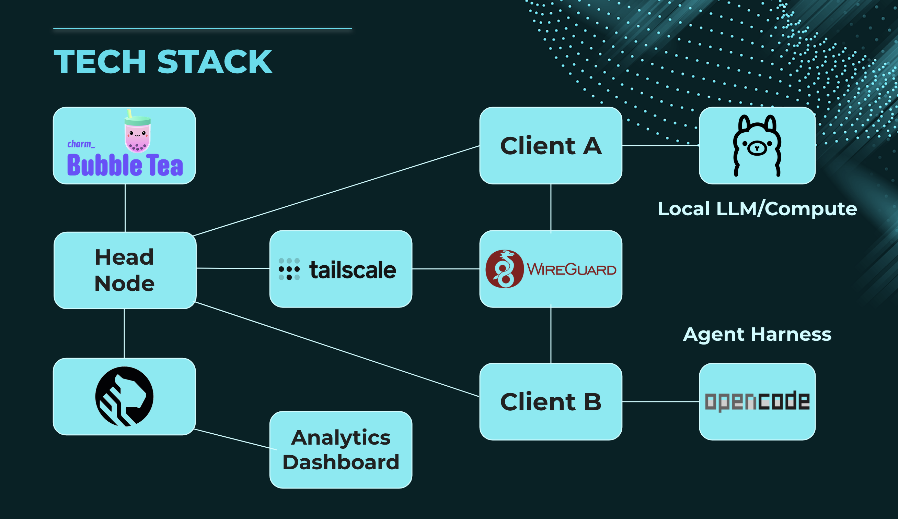
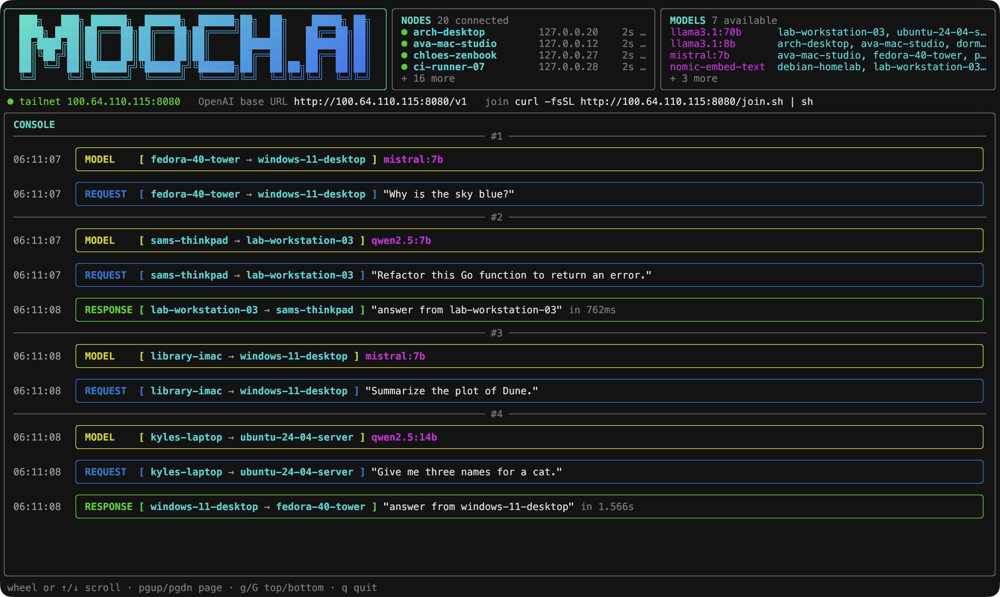
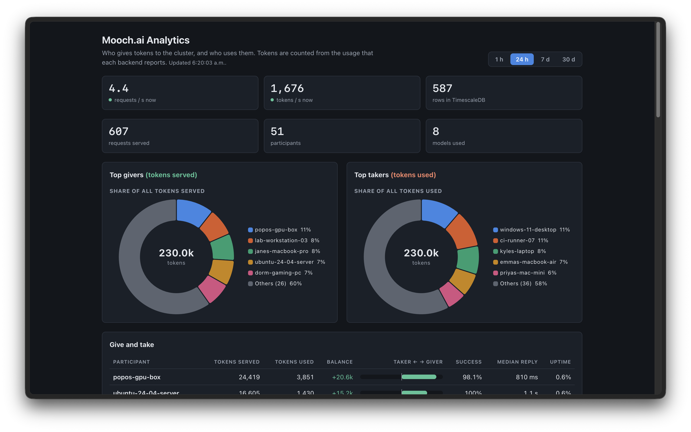

# Mooch.ai

Mooch.ai connects the computers on one Tailscale network into one AI cluster.
Each computer shares the models of its local backends, such as Ollama, vLLM, or llama.cpp.
Your tools send OpenAI requests to one address.
Mooch.ai sends each request to a computer that has the requested model.

## How it works

Mooch.ai has two programs:

| Program | Job |
|---------|-----|
| `mooch-central` | Keeps the list of live nodes and their models. Receives OpenAI requests and sends each request to a node. Shows a terminal dashboard. |
| `mooch-node` | Runs next to the local backends. Sends its models to central (register and heartbeat). Forwards routed requests to the correct backend. |

These words have one meaning in all Mooch.ai documents:

| Word | Meaning |
|------|---------|
| central | The server that routes requests (`mooch-central`). |
| node | A computer that runs `mooch-node`. |
| backend | A local model service on a node, such as Ollama. |
| service | One backend entry that a node advertises to central. |
| model | A model ID, such as `qwen2.5:7b`. |



## Requirements

- Go 1.24 or later, to build from source.
- Tailscale on each computer. All computers must be on the same tailnet.
- One or more OpenAI-compatible backends on the nodes, such as Ollama.

## Quick start

### 1. Start central

Start central on one computer of the tailnet:

```sh
cd central
make build  # once: build the node binaries that /join gives to new nodes
make start  # build central, start TimescaleDB, then start central with analytics
```

One `make start` serves all of these at the same time:

| Node and tools | Address |
|--------|---------|
| Nodes and tools on the tailnet | `http://<central-tailscale-ip>:8080` |
| Programs on the central computer, such as the [demo scripts](demo/README.md) | `http://127.0.0.1:8080` |
| The analytics page, on the central computer only | `http://127.0.0.1:3000/analytics` |

`make start` builds central each time. Go keeps a build cache, so a start with no code changes is fast.
`make start` does not build the node binaries. Run `make build` again after you change the code in `node/`.
For local tests without Tailscale, use `make start ADDR=127.0.0.1:8080`.

### 2. Join a computer

Start a backend on the computer that shares models. Example:

```sh
ollama serve
ollama pull qwen2.5
```

Run the join command that the central dashboard shows:

```sh
curl -fsSL http://<central-tailscale-ip>:8080/join.sh | sh
```

The command installs `mooch-node` and a config in `~/.mooch`, and then starts the node.
You can also open `http://<central-tailscale-ip>:8080/join` in a browser.
For a manual setup, read [`node/README.md`](node/README.md).

### 3. Use the models

Set the OpenAI base URL of your tool to central:

```text
http://<central-tailscale-ip>:8080/v1
```

Send a request:

```sh
curl http://<central-tailscale-ip>:8080/v1/chat/completions \
  -H 'Content-Type: application/json' \
  -d '{"model": "qwen2.5", "messages": [{"role": "user", "content": "Hello"}]}'
```

`GET /v1/models` lists all models of the live nodes.
Central also has an Ollama-compatible API (`/api/tags`, `/api/show`, `/api/chat`) for tools such as Zed.

### 4. Add central as a provider

Add central as an OpenAI-compatible provider in your tool.
Central has no authentication. If the tool requires an API key, use any value.

For [opencode](https://opencode.ai), add this provider to `opencode.json` (in the project or in `~/.config/opencode/`):

```json
{
  "$schema": "https://opencode.ai/config.json",
  "provider": {
    "mooch": {
      "npm": "@ai-sdk/openai-compatible",
      "name": "Mooch.ai",
      "options": {
        "baseURL": "http://<central-tailscale-ip>:8080/v1"
      },
      "models": {
        "qwen2.5:7b": { "name": "Qwen 2.5 7B" }
      }
    }
  }
}
```

opencode does not read `/v1/models`. Add one entry in `models` for each model that you want to use.
Each key must be a model ID from `curl http://<central-tailscale-ip>:8080/v1/models`.
Then run `/models` in opencode and select a model from Mooch.ai.

Other OpenAI-compatible tools use the same values:

| Setting | Value |
|---------|-------|
| Base URL | `http://<central-tailscale-ip>:8080/v1` |
| API key | Any value. Central ignores the key. |
| Model | A model ID from `/v1/models` |


## Central Dashboard

Central shows a terminal dashboard when it runs in a terminal:



- **NODES** shows the live nodes. A yellow dot shows that a node has not sent a heartbeat for 20 seconds.
- **MODELS** shows each available model and the nodes that serve the model, separated by commas.
- **CONSOLE** shows each request in three frames: MODEL (yellow), REQUEST (blue), and RESPONSE (green, or red for an error).
  Each line shows the direction, for example `[ laptop → gpu-box ]`.
  MODEL shows the selected model. REQUEST shows the prompt. RESPONSE shows the answer and the duration.
  A divider with the request number (`#1`) starts the frames of each request.
  When a line is too long, the dashboard cuts the prompt or the answer first.
  Use `-details` to also show the method, the path, and the status. RESPONSE always shows an error status.

Use these keys in the dashboard:

| Key | Action |
|-----|--------|
| Mouse wheel or trackpad | Scroll the console three lines |
| `↑` `↓` or `k` `j` | Scroll the console one line |
| `PgUp` `PgDn` | Scroll the console one page |
| `g` `G` | Go to the top or the bottom of the console |
| `q` | Stop central |

The dashboard reads the mouse for the wheel. To select text, hold `Option` (macOS) or `Shift` (most Linux terminals) while you drag.

Use `-plain` to print the events as lines without the dashboard. The lines also show the nodes that join or leave.
Use `-verbose` to print plain log lines.
Central prints lines automatically when its output is not a terminal.

## Analytics



Central can keep a usage history in TimescaleDB, the open-source database of Tiger Data:

```sh
cd central
make start  # start TimescaleDB on 127.0.0.1, then start central with analytics
```

`make start` always turns on analytics. Docker must run on the central computer.

On the central machine, open `http://127.0.0.1:3000/analytics` to see these values. Other machines cannot open it.

- The share of tokens that each participant gives and uses, with the total in each chart.
- The balance of each participant: tokens served minus tokens used.
- The live request rate and the use of each model. The page updates every half second.

The [`demo/`](demo/README.md) folder has scripts that simulate a cluster of 20 users.
The scripts connect to the same central that `make start` runs. You do not need a special mode.

With the database, central sends each request to the node with the least work in the last hour.

## Repository layout

```text
node/                   mooch-node (Go module mooch-node)
  cmd/mooch-node/         the node binary
  internal/config/        config file, default paths, validation
  internal/identity/      Tailscale IP, node ID, listen address
  internal/central/       register and heartbeat to central
  internal/server/         listener, /healthz, OpenAI routes
  internal/proxy/         forward each request to the backend of its model
  internal/tui/           node dashboard
central/                   mooch-central (Go module mooch-central)
  cmd/mooch-central/      the central binary
  internal/registry/      live nodes and model lookup
  internal/router/        OpenAI routes and forwarding
  internal/api/           node register and heartbeat routes
  internal/ollama/        Ollama-compatible routes
  internal/join/          join page, install script, node binaries
  internal/feed/          console event lines
  internal/tui/           terminal dashboard
  internal/stats/         usage history, /analytics page, fair routing
demo/                     cluster simulators for the analytics page
frontend/                 static site for mooch.tech
REQUIREMENTS.md           node requirements
AGENTS.md                 rules for contributors and coding agents
```

More documents:

- [`node/README.md`](node/README.md): node setup, config, logs, and troubleshooting.
- [`central/README.md`](central/README.md): central flags, endpoints, and request flow.
- [`demo/README.md`](demo/README.md): analytics demo scripts.
- [`frontend/README.md`](frontend/README.md): the mooch.tech site.
- [`REQUIREMENTS.md`](REQUIREMENTS.md): the node requirements.

## Development

Run these checks in `node/` and in `central/` before a push:

```sh
gofmt -l .                # the output must be empty
go vet ./...
go test ./... -count=1
```

Each push to a shared branch needs a GitHub issue and a pull request.
Read [`AGENTS.md`](AGENTS.md) for the full workflow and the writing rules.

## Security

Central has no authentication.
All computers that can connect to central can use all live nodes and models.
Central relies on your tailnet to control access.
Central also listens on `127.0.0.1`. Only programs on the central computer can use that address.
Do not expose central on a public address.

The analytics database is optional.
The database listens on `127.0.0.1` of the central computer only.
Central keeps metadata only, such as time, node, model, status, and duration.
Central does not keep prompt text or response text.
Read [`central/README.md`](central/README.md#analytics) for more information.
